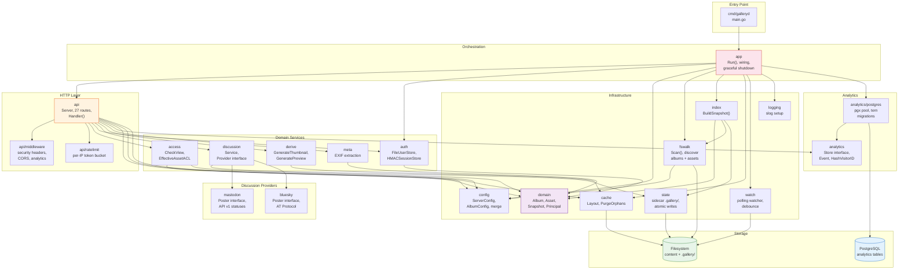
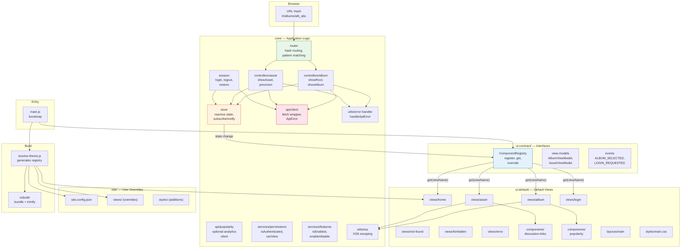
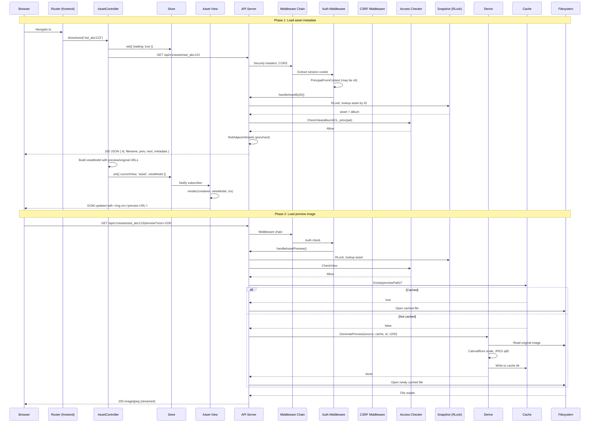
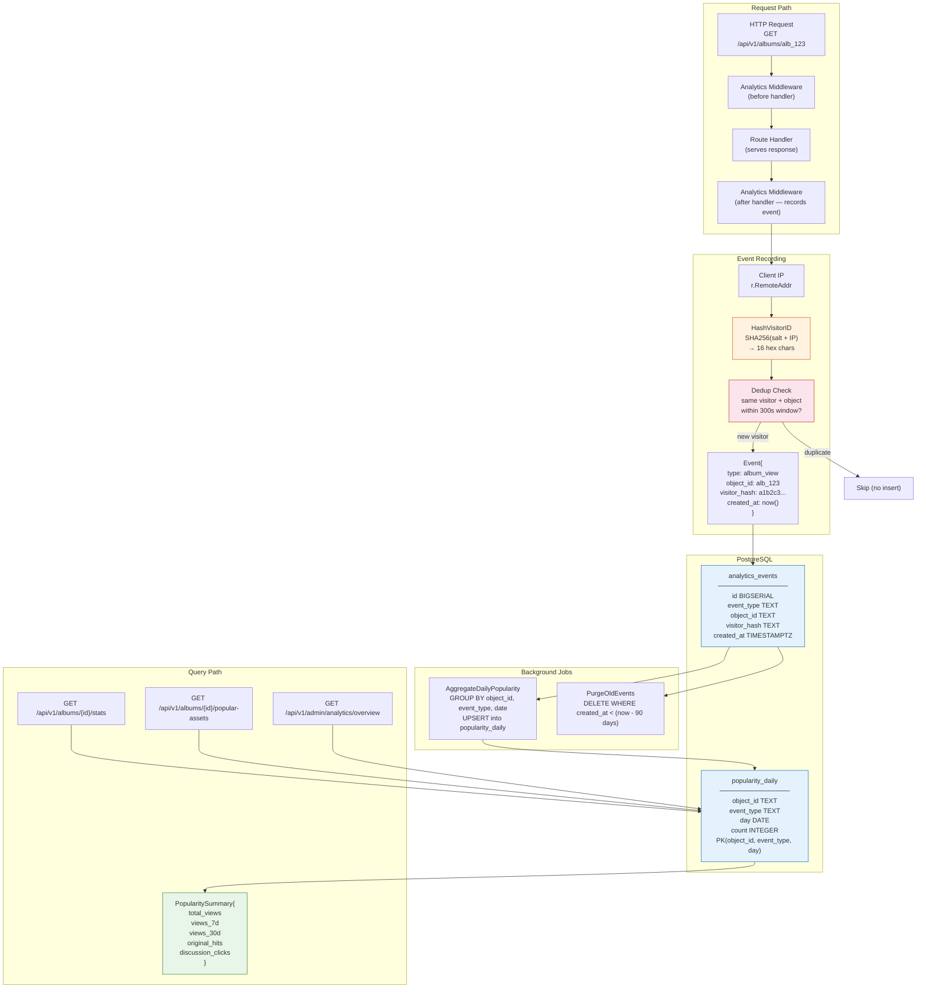
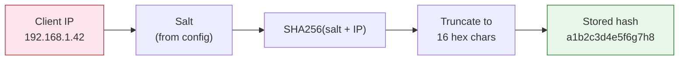
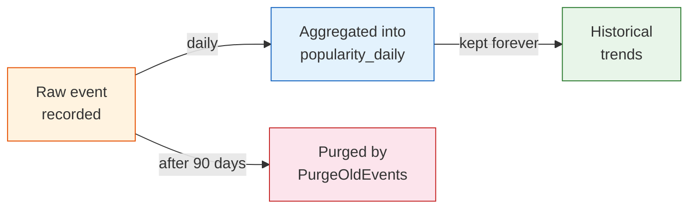

# Architecture Diagrams

## 1. Backend Subsystem Diagram

## 2. Frontend Architecture Diagram

## 3. Data Flow: Serving an Asset

## 4. Popularity Analytics Pipeline

### Event Types

| Event Type | Recorded When | Object ID |
|------------|---------------|-----------|
| `album_view` | Album page loaded | Album ID (`alb_*`) |
| `asset_view` | Asset detail page loaded | Asset ID (`ast_*`) |
| `original_hit` | Original file downloaded | Asset ID (`ast_*`) |
| `discussion_click` | Discussion link clicked | Asset or Album ID |

### Privacy Model

- Raw IPs are **never stored**
- Hashing is one-way — IPs cannot be recovered
- Salt rotation invalidates old hashes (new "visitors")
- `hash_ip: true` in config enables this (default)

### Retention Lifecycle

